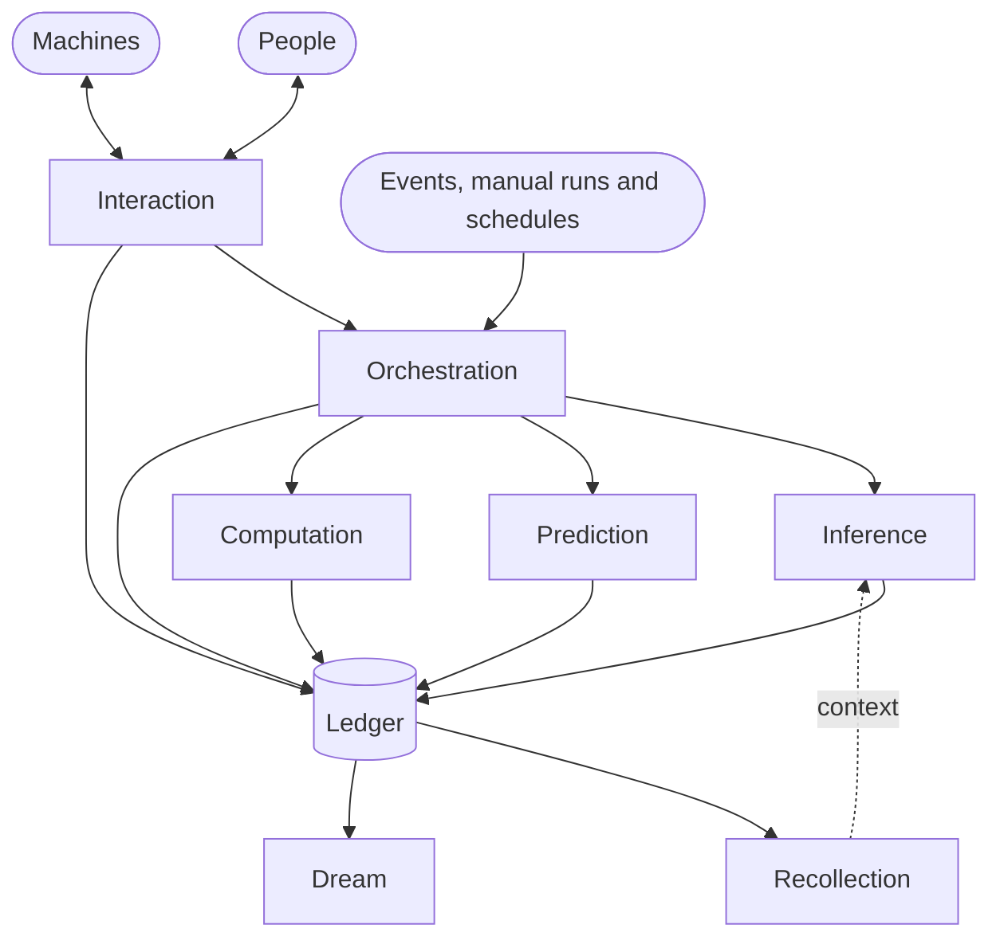

# auto-brain

**The runtime for business brains.**

[](https://github.com/BeOnAuto/auto-brain/actions/workflows/ci.yml)
[](https://scorecard.dev/viewer/?uri=github.com/BeOnAuto/auto-brain)
[](LICENSING.md)

A business brain carries out the way your team works. It gathers context, calls models, runs deterministic steps, and asks people or systems for input when it needs it. Every step lands on a ledger, so the brain's work can be recalled, explained and improved.

auto-brain is the server a brain runs on. Auto can host it for you, or you can run it yourself from one container image.

> **Status: early development.** The server, its container image and the release pipeline are in place. The server can create, list, read, update and retire an org's brains on the ledger, and run specs in them: inference specs, which call a language model, and, when it is given a Temporal server, workflow specs, which execute other specs and wait for events. The other primitives below are being designed and built, so auto-brain isn't ready for production use yet.

## How a brain works

A brain is made of **primitives** that share one **ledger**.

| Primitive                                 | What it does                                                                                                                                                        |
| ----------------------------------------- | ------------------------------------------------------------------------------------------------------------------------------------------------------------------- |
| [Interaction](primitives/interaction)     | Input and output between the brain and people or machines, in both directions                                                                                       |
| [Orchestration](primitives/orchestration) | Deterministic steps that run other primitives, triggered by an event, by hand or on a schedule                                                                      |
| [Inference](primitives/inference)         | An LLM call defined in Markdown: front matter sets the model, skills, tools and input and output schemas; a Liquid body pulls in context from the rest of the brain |
| [Prediction](primitives/prediction)       | A machine-learning model that makes a prediction, for when an LLM isn't the right tool                                                                              |
| [Computation](primitives/computation)     | A deterministic function that workflows and agents can call                                                                                                         |
| [Recollection](primitives/recollection)   | A materialized view of the brain's history, built from the ledger                                                                                                   |
| [Dream](primitives/dream)                 | Explores the ledger around a subject to suggest new scenarios and better ways of working, and can iterate towards a goal                                            |

The [ledger](packages/ledger) records every input and output of every primitive. That record lets a brain recall what happened and explain its decisions. It also lets you evaluate and improve the method over time.



## Where it fits

Three separate things:

- **Auto Studio** is the management plane at [on.auto](https://on.auto), with governance and observability for your brains.
- **Cloud hosting** means Auto runs auto-brain for you, so there's no infrastructure to operate.
- **Self-hosting** means you run the same image on your own infrastructure, free up to a usage threshold (see [Licensing](#licensing)).

## Run it

### Quick start

From a checkout, `pnpm dev` runs the server in [local mode](#local-mode), so it needs no key. Create a brain, then read it back:

```bash
pnpm install
pnpm dev
curl --request POST http://localhost:8080/v1/orgs/acme/brains \
  --header 'content-type: application/json' \
  --data '{"brain":"sales","name":"Sales","description":"Answers questions about the pipeline"}'
curl http://localhost:8080/v1/orgs/acme/brains
curl http://localhost:8080/v1/orgs/acme/brains/sales
```

`PUT /v1/orgs/acme/brains/sales` replaces the name and the description, and `POST /v1/orgs/acme/brains/sales/retire` retires the brain for good. `pnpm dev` keeps the ledger in `packages/server/.data/ledger.db`, so the brains are still there after a restart.

### How it works

A brain does its work through specs: named, versioned documents, each for one primitive. An inference spec calls a language model, so give the server a key for a provider before it starts:

```bash
export ANTHROPIC_API_KEY=sk-ant-...
pnpm dev
```

Write a spec, `greeting.md`: YAML front matter that names the model, then a Liquid template that renders the prompt from the input.

```markdown
---
description: Greets a customer
model: anthropic/claude-sonnet-4-5
input:
  schema: { type: object, properties: { name: { type: string } }, required: [name] }
---

You write one warm sentence.
Greet {{ input.name }}, whose order shipped today, {{ today }}.
```

Create a brain, create the spec in it, execute the spec, and read the execution back with the record of the call: the rendered prompt, the model, the tokens it used and how long it took.

```bash
curl --request POST http://localhost:8080/v1/orgs/acme/brains \
  --header 'content-type: application/json' --data '{"brain":"sales","name":"Sales"}'
jq --null-input --rawfile source greeting.md '{name: "greeting", source: $source}' |
  curl --request POST http://localhost:8080/v1/orgs/acme/brains/sales/specs/inference \
    --header 'content-type: application/json' --data @-
curl --request POST http://localhost:8080/v1/orgs/acme/brains/sales/specs/inference/greeting/execute \
  --header 'content-type: application/json' \
  --data '{"input":{"name":"Ada"},"execution_id":"0199a3c4-7d2e-7c1a-9b3f-2f1e0d9c8b7a"}'
curl http://localhost:8080/v1/orgs/acme/brains/sales/executions/0199a3c4-7d2e-7c1a-9b3f-2f1e0d9c8b7a
```

A document with a problem is rejected with every problem and its line; an input that does not match the schema is rejected before any model is called; a provider that is not configured answers `503`, naming the settings it lacks. The [inference README](primitives/inference/README.md) describes the document, the template language, every rejection and the record, and the [specs README](packages/specs/README.md) the operations. `scripts/try-inference.sh <base-url> <provider/model>` runs the same steps with a spec of its own against a server that is already running. An agent does the same over [MCP](#connecting-an-agent-over-mcp) on the brain's endpoint, `/orgs/acme/brains/sales/mcp`, where the descriptions of the spec tools explain how an inference spec is written.

A workflow spec runs steps that execute other specs, branch, wait and listen for events, durably, on [Temporal](#workflows-and-temporal). Start a Temporal dev server and give the server its address:

```bash
temporal server start-dev
TEMPORAL_ADDRESS=localhost:7233 pnpm dev
```

Write `welcome.yaml`, a workflow that executes the greeting above, then waits for the customer's reply:

```yaml
document:
  dsl: '1.0.3'
  namespace: acme
  name: welcome
  version: '1.0.0'
  summary: Greets a customer, then waits for their reply.
do:
  - greet:
      call: execute_spec
      with:
        primitive: inference
        name: greeting
        input:
          name: ${ .name }
      output:
        as: '${ { greeting: . } }'
  - await:
      listen:
        to:
          one:
            with: { type: com.acme.customer.replied }
      output:
        as: '${ $input + { reply: .[0] } }'
```

Create it, execute it, and send it the event it waits for:

```bash
jq --null-input --rawfile source welcome.yaml '{name: "welcome", source: $source}' |
  curl --request POST http://localhost:8080/v1/orgs/acme/brains/sales/specs/orchestration \
    --header 'content-type: application/json' --data @-
curl --request POST http://localhost:8080/v1/orgs/acme/brains/sales/specs/orchestration/welcome/execute \
  --header 'content-type: application/json' \
  --data '{"input":{"name":"Ada"},"execution_id":"0199a3c4-7d2e-7c1a-9b3f-2f1e0d9c8b7b"}'
curl --request POST http://localhost:8080/v1/orgs/acme/brains/sales/executions/0199a3c4-7d2e-7c1a-9b3f-2f1e0d9c8b7b/events \
  --header 'content-type: application/json' \
  --data '{"event":{"type":"com.acme.customer.replied","data":"Thank you!"}}'
curl http://localhost:8080/v1/orgs/acme/brains/sales/executions/0199a3c4-7d2e-7c1a-9b3f-2f1e0d9c8b7b
```

Executing answers `started` at once; the execution reads `started` until the workflow ends, and then `succeeded` with `{"greeting": ..., "reply": "Thank you!"}`. The greeting the workflow executed is an execution of its own in the ledger, under an id derived from the workflow's run, made by the caller who started the workflow. The [orchestration README](primitives/orchestration/README.md) describes what a workflow may do, and `scripts/try-workflows.sh <base-url> <provider/model>` runs these steps against a server that is already running.

### In a container

Every release publishes the image to Docker Hub (`beonauto/auto-brain`) and GitHub Container Registry (`ghcr.io/beonauto/auto-brain`). A container needs two things: an [API key](#api-keys), because it listens on every interface, and a volume on `/data`, where it keeps the ledger.

```bash
docker run --rm --log-driver none beonauto/auto-brain:latest node packages/identity/src/key-command.ts --org acme
echo 'API_KEYS=[<the API_KEYS entry it printed>]' > auto-brain.env
docker volume create auto-brain-data
docker run --rm --publish 8080:8080 --env-file auto-brain.env --volume auto-brain-data:/data beonauto/auto-brain:latest
curl --header 'authorization: Bearer <the key it printed>' http://localhost:8080/v1/orgs/acme/brains
```

Without a named volume, Docker gives each container a fresh anonymous volume, so its brains last only as long as that container.

| Variable          | Default                                          | Purpose                                                                                                                        |
| ----------------- | ------------------------------------------------ | ------------------------------------------------------------------------------------------------------------------------------ |
| `PORT`            | `8080`                                           | Port the server listens on                                                                                                     |
| `HOST`            | `0.0.0.0`                                        | Interface the server binds to                                                                                                  |
| `ALLOWED_ORIGINS` | none                                             | Comma-separated origins a browser page may call the API from, with CORS; see [Calling from a browser](#calling-from-a-browser) |
| `API_KEYS`        | none                                             | The API keys the server accepts, as a compact JSON array of entries made by the key command                                    |
| `LEDGER_FILE`     | `data/ledger.db`; `/data/ledger.db` in the image | The SQLite database file of the ledger; its directory is created when missing                                                  |
| `LOCAL_MODE`      | `false`                                          | `true` trusts every request as the local developer; see [Local mode](#local-mode)                                              |

The [inference primitive](primitives/inference) calls language models with these settings, all optional. A provider whose settings are absent is not configured, and a spec that names it is rejected as `unavailable` when it runs; the server logs, when it starts, which providers are configured and what each of the others lacks. Settings it cannot read stop it at start-up, naming the setting and never its value. The primitive's README has an example for each deployment shape.

| Variable                                                                                         | Purpose                                                                                                                |
| ------------------------------------------------------------------------------------------------ | ---------------------------------------------------------------------------------------------------------------------- |
| `ANTHROPIC_API_KEY` or `ANTHROPIC_AUTH_TOKEN`, `ANTHROPIC_BASE_URL`                              | Anthropic (`anthropic/...`)                                                                                            |
| `OPENAI_API_KEY`, `OPENAI_BASE_URL`, `OPENAI_API`                                                | OpenAI (`openai/...`); `OPENAI_API=chat_completions` for endpoints without the Responses API                           |
| `GOOGLE_GENERATIVE_AI_API_KEY`                                                                   | Gemini API (`google/...`)                                                                                              |
| `AWS_REGION`, `AWS_BEARER_TOKEN_BEDROCK`, `AWS_ENDPOINT_URL_BEDROCK_RUNTIME`, `AWS_ENDPOINT_URL` | Amazon Bedrock (`bedrock/...`, `bedrock-anthropic/...`), with the AWS default credential chain                         |
| `AZURE_RESOURCE_NAME` or `AZURE_BASE_URL`, `AZURE_API_KEY`, `AZURE_API_VERSION`                  | Azure OpenAI (`azure/...`); without a key, Microsoft Entra ID in an image built with `--build-arg AZURE_IDENTITY=true` |
| `GOOGLE_VERTEX_PROJECT`, `GOOGLE_VERTEX_LOCATION`                                                | Vertex AI (`vertex/...`, `vertex-anthropic/...`), with Google application default credentials                          |
| `MODEL_GATEWAYS`                                                                                 | JSON list of OpenAI-compatible gateways, each its own provider prefix                                                  |
| `MODEL_ALIASES`                                                                                  | JSON map from one model reference to another                                                                           |
| `NODE_USE_ENV_PROXY`, `HTTPS_PROXY`, `NO_PROXY`, `NODE_EXTRA_CA_CERTS`                           | Node's own switches for an outbound proxy and a private certificate authority                                          |

The [orchestration primitive](primitives/orchestration) runs workflow specs on Temporal with these settings. Without `TEMPORAL_ADDRESS` the server does not offer workflows: the spec operations serve only the other primitives, and no Temporal code is loaded. The server logs at start-up whether it offers workflows, and with which Temporal server, namespace and task queue.

| Variable                          | Default                                   | Purpose                                                                                           |
| --------------------------------- | ----------------------------------------- | ------------------------------------------------------------------------------------------------- |
| `TEMPORAL_ADDRESS`                | none                                      | `host:port` of the Temporal frontend; set, the server offers workflows                            |
| `TEMPORAL_NAMESPACE`              | `default`                                 | Temporal namespace                                                                                |
| `TEMPORAL_TASK_QUEUE`             | `auto-brain`                              | Task queue the server's worker polls and its workflows start on                                   |
| `TEMPORAL_API_KEY`                | none                                      | API key, for Temporal Cloud; implies TLS                                                          |
| `TEMPORAL_TLS`                    | `false`                                   | Whether to connect with TLS                                                                       |
| `ORCHESTRATION_MAX_DURATION`      | `P30D`                                    | The most a workflow may run, an ISO 8601 duration from `PT2H` to `P365D`                          |
| `ORCHESTRATION_NESTED_EXECUTIONS` | `32`                                      | How many nested executions the server runs at once, from 1 to 1000; shared by every org           |
| `ORCHESTRATION_WORKFLOW_BUNDLE`   | none; `/app/workflow-bundle` in the image | Directory of the workflow code bundled ahead of time; unset, the worker bundles it when it starts |

The image is multi-arch (amd64 and arm64), runs as a non-root user that can read but not change its own code, keeps the ledger on the `/data` volume, where that user may write, as it may only in `/tmp`, `/var/tmp`, `/run/lock` and its home `/home/node` besides, and shuts down cleanly on `SIGTERM`, even in its first milliseconds, because `tini` runs as PID 1 and forwards the signal to the server. Its SQLite driver is compiled from source while the image is built, and its workflow code is bundled while the image is built, checked against the code the image runs. A second `SIGTERM` or `SIGINT` ends the server at once with exit code 1.

### Workflows and Temporal

The server runs the Temporal worker for its workflows in its own process, on the task queue `TEMPORAL_TASK_QUEUE`; give each deployment its own task queue, or its own namespace, so that no other deployment's worker takes its workflows. For local development, the [Temporal CLI](https://docs.temporal.io/cli)'s `temporal server start-dev` runs a dev server on `localhost:7233` that keeps everything in memory, or run it in a container, `docker run --publish 7233:7233 temporalio/temporal server start-dev --ip 0.0.0.0`.

The server starts whether Temporal can be reached or not. Until it can, it logs a warning each time it tries to start the worker, waiting a random time between half and all of a ceiling that doubles from 1 second up to 30 seconds, so 0.5 to 1 second the first time, and executing a workflow spec answers `503` `unavailable` within 10 seconds; once Temporal is back, workflows run without a restart. A worker that loses Temporal while it runs logs one warning, then at most one a minute while the outage lasts, and one line when it reaches Temporal again. A worker that stops on its own is logged as an error and started again the same way. When the server stops, it stops accepting requests, gives the activities in flight 10 seconds to finish while the requests in flight finish, and then closes the ledger; with Temporal unreachable and requests waiting for it, stopping can take up to about 16 seconds, so allow the container at least 20 (`docker stop --time 20`).

The container needs memory for the server, and more once it offers workflows. Give it at least 512 MiB without workflows and 1 GiB with them (`docker run --memory 1g`). Node sizes its heap from the container's limit, to about half of it: 268 MiB at 512 MiB, 408 MiB at 768 MiB, 536 MiB at 1 GiB. Measured with the arm64 image, the container counted about 100 MiB idle without workflows, and at most 150 MiB besides the ledger's cached file pages through floods of 2048 rejected specs of 64 KiB and 2048 executions with inputs of 256 KiB; it survived them at 256 MiB. With workflows it counted 190 to 390 MiB idle, more under a larger limit, since Node collects less often with more room; a key sending 1.1 GiB of events to 16 of its waiting workflows, 2048 events to 8 more, and the two floods above left it answering `/health` within 100 ms and other requests within 200 ms at 384 MiB, 512 MiB, 768 MiB and 1 GiB, and it was killed at 256 MiB. 1 GiB holds what the server needs idle and what workflows can hold at once by the bound the [orchestration README](primitives/orchestration/README.md#memory) derives, which none of these floods reached, because a flooded workflow fails at its limits. At the limit, the kernel first drops the cached pages of the ledger's file, which the execution flood filled to the limit without harm, and then kills the process (exit 137, `OOMKilled`); the container's restart policy starts it again, requests in flight are lost, and workflows go on from Temporal's history.

What an operator must know:

- Temporal's history of each workflow holds its document, its input, the outputs of the specs it executes, the events sent to it and the identity of the caller who started it, unencrypted in this version: whoever can read the namespace can read that tenant data. Access to the namespace is an operator's privilege; grant it accordingly.
- A workflow acts for the caller who started it, with the permissions that caller had then, for as long as it runs, at most `ORCHESTRATION_MAX_DURATION`. Revoking the caller's key does not stop it. To stop one, `temporal workflow cancel --workflow-id <org>/<brain>/<spec>/<execution id>` cancels what it is doing and settles its execution `failed`, and the workflow ends `CANCELLED` in Temporal; `temporal workflow terminate` ends it without running any more of its code, so its execution stays `started`.
- `/health` answers whether the server is alive, not whether its workflow worker runs; the log says that (`The workflow worker started`, and the warnings above).
- There are no limits for one org, and no fairness between orgs: every org's workflows share the server's worker, its 16 cached workflows, its 2 workflow tasks and its `ORCHESTRATION_NESTED_EXECUTIONS` nested executions at a time.
- An execution whose workflow could not settle it stays `started`; the server logs it as an error with its org, brain, execution id and reason, and reconciling it is manual in this version.

### API keys

Every path except `/health` needs an API key, sent as `Authorization: Bearer <key>`. Each key belongs to one org and carries its permissions and the brains it may access. The key command creates one:

```bash
docker run --rm --log-driver none beonauto/auto-brain:latest node packages/identity/src/key-command.ts --org <org>
```

Options are `--id`, `--permissions` (comma-separated, from `org:read`, `org:write`, `brain:read`, `brain:write`; all four by default) and `--brains` (comma-separated brain ids, or `*` for every brain, the default). The command prints the key once and the entry to add to `API_KEYS`; only the key's SHA-256 is stored, so keep the key itself somewhere safe. Write the variable unquoted, for example `API_KEYS=[{"id":"…",…}]` in an env file. `--log-driver none` keeps the key out of Docker's log driver, which could otherwise store or ship it; the command still prints it to your terminal.

Following [RFC 6750](https://www.rfc-editor.org/rfc/rfc6750), a request without an `Authorization` header gets `401` with `WWW-Authenticate: Bearer`, a key that is not valid gets `401` with `error="invalid_token"`, an `Authorization` header that is not exactly one `Bearer <key>` gets `400` with `error="invalid_request"`, and a key that lacks the permission, brain or org a call needs gets `403` with `error="insufficient_scope"`.

Without `API_KEYS`, or with `API_KEYS=[]`, and without local mode, the server rejects every path except `/health` with `401`, on any address, and warns at start-up that no request can authenticate.

### Local mode

Local mode is for development on your own machine. It is on only when `LOCAL_MODE=true`, the server listens only on a loopback address (`localhost`, `127.0.0.1` or `::1`), and `API_KEYS` is not set. Then every request acts as a local developer with every permission in whichever org it names, and no key is needed; the server logs a warning saying so when it starts. To stop a web page from driving it, local mode rejects a request whose `Host` header is not a localhost name, and, as always, a request whose `Origin` is not in `ALLOWED_ORIGINS`.

> **Warning:** never enable local mode on a machine that can be reached through a proxy. A reverse proxy on the same machine, such as nginx with its default settings, forwards remote requests to the loopback address with a localhost `Host` header, so the server would trust every remote client as the local developer.

`LOCAL_MODE=true` with an address that is not loopback stops the server at start-up with an `InvalidLocalModeError`. With `API_KEYS` set, keys are enforced and the server warns that `LOCAL_MODE` is ignored. `pnpm dev` sets `LOCAL_MODE=true` and listens on `127.0.0.1`, so it runs in local mode; `pnpm key -- --org <org>` creates a key from a checkout.

### Calling from a browser

A page may call the API only from an origin listed in `ALLOWED_ORIGINS`; a request with any other `Origin` header gets `403`. For a listed origin the server answers CORS: a preflight (`OPTIONS` with `Access-Control-Request-Method`) gets `204` before any key is checked, allowing `GET`, `HEAD`, `POST` and `PUT` with the `authorization` and `content-type` headers, and every response carries `Access-Control-Allow-Origin` with that origin, `Vary: Origin`, and `x-request-id` among the headers the page may read. There is no wildcard and no credentials mode: the page sends its API key in the `Authorization` header.

### Connecting an agent over MCP

Every org is also an [MCP](https://modelcontextprotocol.io) server, so an agent can call the same operations as tools. Point the agent's MCP client at the org's endpoint, with an [API key](#api-keys) of that org:

```json
{
  "mcpServers": {
    "auto-brain": {
      "type": "http",
      "url": "http://localhost:8080/orgs/acme/mcp",
      "headers": { "Authorization": "Bearer <key>" }
    }
  }
}
```

Most MCP clients take an entry of this shape; in [local mode](#local-mode), leave out the headers. The endpoint speaks streamable HTTP without sessions. It serves the current stateless revision (`2026-07-28`) and the earlier ones the SDK supports (`2025-11-25`, `2025-06-18`, `2025-03-26`, `2024-11-05` and `2024-10-07`), so agents built on older SDKs connect too.

| Endpoint                              | Tools                                                                                                                                                                                                                                                        |
| ------------------------------------- | ------------------------------------------------------------------------------------------------------------------------------------------------------------------------------------------------------------------------------------------------------------ |
| `POST /orgs/{org}/mcp`                | `create_brain`, `list_brains`, `get_brain`, `update_brain` and `retire_brain`                                                                                                                                                                                |
| `POST /orgs/{org}/brains/{brain}/mcp` | `create_spec`, `list_specs`, `get_spec`, `update_spec`, `retire_spec`, `execute_spec` and `get_execution`, for the inference and, when workflows are offered, orchestration primitives; and, when workflows are offered, `send_execution_event`: eight tools |

Each tool carries the operation's description and its input and output JSON Schemas, and is marked read-only when it only reads. A tool that cannot do what was asked returns `isError` with the same problem document HTTP would answer with, as text, so the agent can read the `reason` and the `detail`, and correct its arguments when the `reason` is `invalid_input`. The key's permissions and brains hold as they do over HTTP: a read-only key can call `list_brains` but gets `forbidden` from `create_brain`. [`packages/api`](packages/api) describes both mappings in full.

### Errors

Every error is an [RFC 9457](https://www.rfc-editor.org/rfc/rfc9457) problem document (`application/problem+json`) with a machine-readable `reason`, such as `bad_request`, `invalid_input` (with an `errors` list of JSON pointers), `forbidden`, `not_found` or `conflict`. A `500` says nothing about the cause; its `instance` is `urn:uuid:<id>`, and the server logs the error to stderr under `"incident":"<id>"` together with `"requestId"`, the value of the response's `x-request-id` header, so either id finds the log line. A request that Node's HTTP parser rejects before the API sees it, such as one with oversized headers or invalid framing, gets a bare status line, such as `431` or `400`, and no problem document.

## Licensing

auto-brain is **source-available** under the [Elastic License 2.0](LICENSE), the same model Apollo uses for its GraphQL router.

- Self-hosting is free up to a usage threshold. Above it, you need a commercial license from Auto.
- You can't offer auto-brain to others as a hosted or managed service.

[LICENSING.md](LICENSING.md) explains what's allowed, when you need a license, and how to get one.

## Contributing

Contributions are welcome. Start with [CONTRIBUTING.md](CONTRIBUTING.md). You'll sign the [CLA](CLA.md) on your first pull request, and everyone follows the [Code of Conduct](CODE_OF_CONDUCT.md). Report vulnerabilities privately as described in [SECURITY.md](SECURITY.md).

Local development needs Node 26 and pnpm 12:

```bash
pnpm install
pnpm dev          # server on http://localhost:8080, reloading on save
pnpm test:watch   # tests on save
pnpm check        # everything CI checks
```

## Repository layout

| Path                       | What's there                                                                                                                                             |
| -------------------------- | -------------------------------------------------------------------------------------------------------------------------------------------------------- |
| `packages/server`          | The HTTP server (`@beonauto/server`), which serves the brain and spec operations on the ledger over HTTP and MCP, and its container build (`Dockerfile`) |
| `packages/api`             | The API (`@beonauto/api`) the server answers every request with: each operation as an HTTP route and as an MCP tool                                      |
| `packages/config`          | Reads the server's configuration from the environment                                                                                                    |
| `packages/identity`        | API keys, local mode and the key command                                                                                                                 |
| `packages/operations`      | The application layer: where operations are defined and run                                                                                              |
| `packages/brains`          | The brain operations: create, list, read, update and retire an org's brains                                                                              |
| `packages/specs`           | The spec operations: define, version, retire and execute the specs of a brain's primitives                                                               |
| `packages/ledger`          | The ledger every primitive records to: event streams on Emmett and SQLite                                                                                |
| `primitives/orchestration` | Workflow specs in the Open Workflow DSL, run on Temporal by one interpreter workflow; the server serves them when `TEMPORAL_ADDRESS` is set              |
| `primitives/*`             | One package per primitive; `primitives/inference` renders prompts from specs and calls language models                                                   |
| `scripts`                  | `try-inference.sh` and `try-workflows.sh`, which create and execute a small inference spec, and a workflow that executes it, against a running server    |
