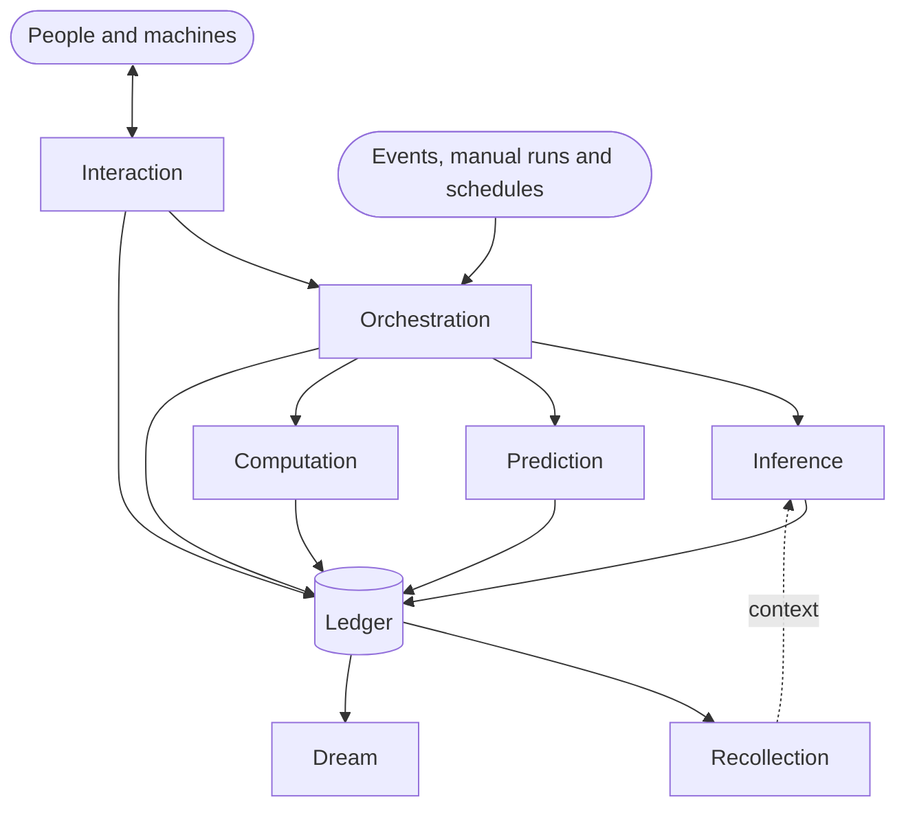

# auto-brain

**The runtime for business brains.**

[](https://github.com/BeOnAuto/auto-brain/actions/workflows/ci.yml)
[](https://scorecard.dev/viewer/?uri=github.com/BeOnAuto/auto-brain)
[](LICENSING.md)

A business brain carries out the way your team works. It gathers context, calls models, runs deterministic steps, and asks people or systems for input when it needs it. Every step lands on a ledger, so the brain's work can be recalled, explained and improved.

auto-brain is the server a brain runs on. Run it yourself from one container image, or use it inside the [Auto studio](https://on.auto).

> **Status: early development.** The server, its container image and the release pipeline are in place. The primitives below are being designed and built, so auto-brain isn't ready for production use yet.

## How a brain works

A brain is made of **primitives** that share one **ledger**.

| Primitive                                 | What it does                                                                                                                                                        |
| ----------------------------------------- | ------------------------------------------------------------------------------------------------------------------------------------------------------------------- |
| [Interaction](primitives/interaction)     | Input and output between the brain and people or machines, in both directions                                                                                       |
| [Orchestration](primitives/orchestration) | Deterministic steps that run other primitives, triggered by an event, by hand or on a schedule                                                                      |
| [Inference](primitives/inference)         | An LLM call defined in Markdown: front matter sets the model, skills, tools and input and output schemas; a Liquid body pulls in context from the rest of the brain |
| [Prediction](primitives/prediction)       | A machine-learning model that makes a prediction, for when an LLM isn't the right tool                                                                              |
| [Computation](primitives/computation)     | A deterministic function that workflows and agents can call                                                                                                         |
| [Recollection](primitives/recollection)   | A materialized view of the brain's history, built from the ledger                                                                                                   |
| [Dream](primitives/dream)                 | Explores the ledger around a subject to suggest new scenarios and better ways of working, and can iterate towards a goal                                            |

The [ledger](packages/ledger) records every input and output of every primitive. That record lets a brain recall what happened and explain its decisions. It also lets you evaluate and improve the method over time.



## Where it fits

- **Auto studio.** Design and run brains at [on.auto](https://on.auto). The studio runs this same server as a managed service.
- **Self-hosted.** Run the same image on your own infrastructure, free up to a usage threshold (see [Licensing](#licensing)).

## Run it

Every release publishes the image to Docker Hub (`beonauto/auto-brain`) and GitHub Container Registry (`ghcr.io/beonauto/auto-brain`):

```bash
docker run --rm --publish 8080:8080 beonauto/auto-brain:latest
curl http://localhost:8080/health
```

| Variable | Default   | Purpose                       |
| -------- | --------- | ----------------------------- |
| `PORT`   | `8080`    | Port the server listens on    |
| `HOST`   | `0.0.0.0` | Interface the server binds to |

The image is multi-arch (amd64 and arm64), runs as a non-root user, and shuts down cleanly on `SIGTERM`.

## Licensing

auto-brain is **source-available** under the [Elastic License 2.0](LICENSE), the same model Apollo uses for its GraphQL router.

- Self-hosting is free up to a usage threshold. Above it, you need a commercial license from Auto.
- You can't offer auto-brain to others as a hosted or managed service.

[LICENSING.md](LICENSING.md) explains what's allowed, when you need a license, and how to get one.

## Contributing

Contributions are welcome. Start with [CONTRIBUTING.md](CONTRIBUTING.md). You'll sign the [CLA](CLA.md) on your first pull request, and everyone follows the [Code of Conduct](CODE_OF_CONDUCT.md). Report vulnerabilities privately as described in [SECURITY.md](SECURITY.md).

Local development needs Node 26 and pnpm 12:

```bash
pnpm install
pnpm dev          # server on http://localhost:8080, reloading on save
pnpm test:watch   # tests on save
pnpm check        # everything CI checks
```

## Repository layout

| Path              | What's there                                                                |
| ----------------- | --------------------------------------------------------------------------- |
| `packages/server` | The HTTP server (`@beonauto/server`) and its container build (`Dockerfile`) |
| `packages/config` | Reads the server's configuration from the environment                       |
| `packages/ledger` | The ledger every primitive records to                                       |
| `primitives/*`    | One package per primitive                                                   |
